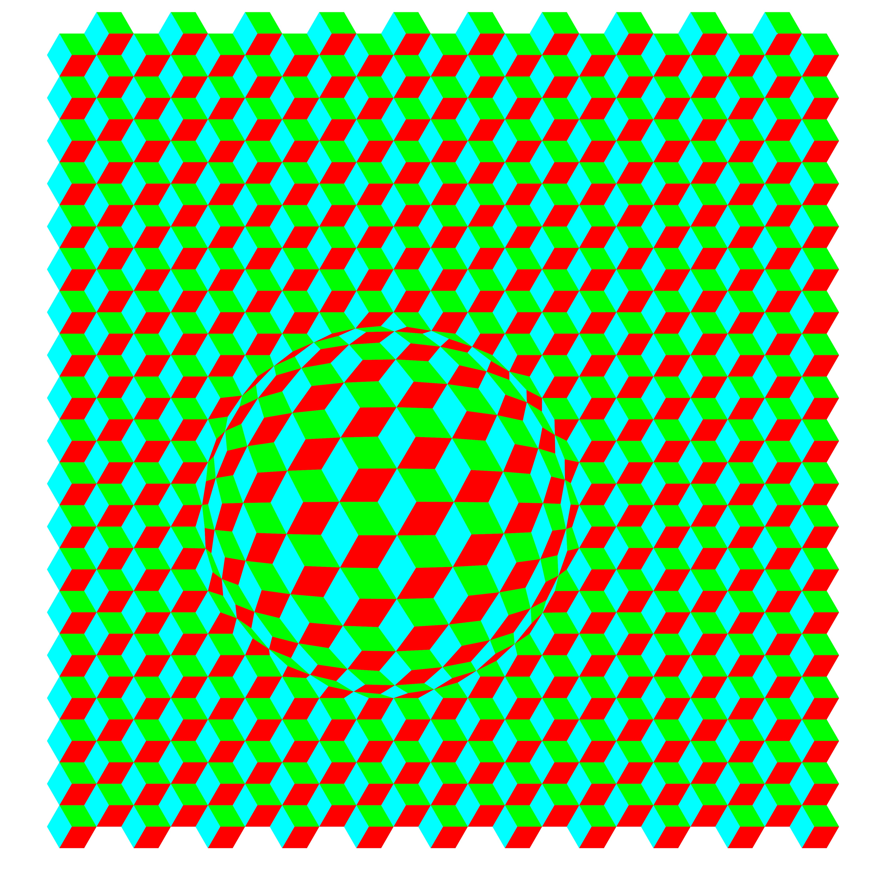

# Projet Vasarely

## Description du projet

Ce projet consiste à générer un pavage d'hexagones colorés avec une sphère de déformation, inspiré des œuvres de Victor Vasarely. Le programme utilise le module `turtle` de Python pour dessiner les hexagones et appliquer une déformation sphérique au pavage.

## Fonctionnalités

- **Pavage d'hexagones** : Le programme génère un pavage régulier d'hexagones tricolores.
- **Déformation sphérique** : Une sphère de déformation est appliquée au pavage, créant un effet 3D.
- **Personnalisation** : Les couleurs, la taille des hexagones, et les paramètres de la sphère de déformation sont configurables.

## Comment utiliser

1. **Exécuter le script** : Lancez le script Python `projet_vasarely.py`.
2. **Paramètres** : Les paramètres du pavage (coin inférieur gauche, coin supérieur droit, longueur des côtés, couleurs, centre et rayon de la sphère) sont définis dans le script.
3. **Résultat** : Le programme génère une image au format EPS (`pavage.eps`) représentant le pavage avec la déformation sphérique.

## Exemple de pavage

